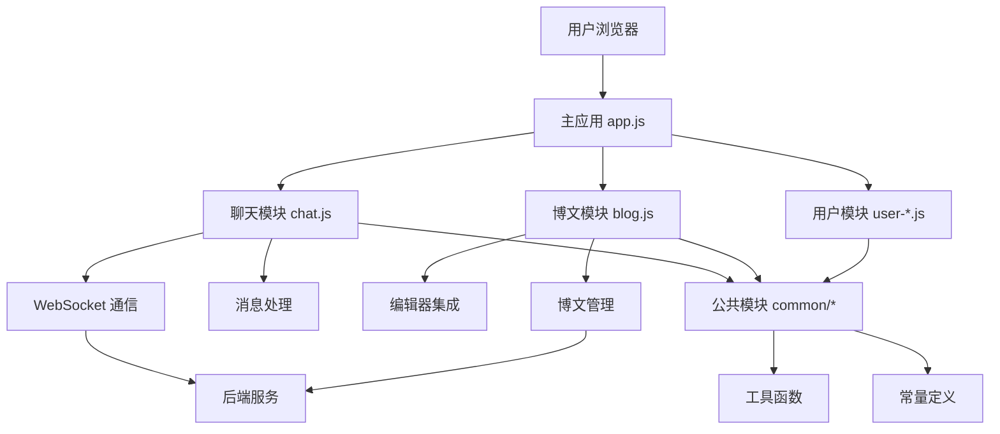

# TMS 前端项目 Code Wiki

## 1. 项目概述

TMS (Team Management System) 是一个基于 Aurelia 框架开发的团队协作系统，提供聊天、博文知识库和国际化翻译等功能。

- **技术栈**: Aurelia 框架 + jQuery + Semantic UI
- **项目类型**: 团队协作系统
- **主要功能**: 实时聊天、博文管理、多种编辑器支持

## 2. 项目结构

### 2.1 目录结构

```
├── src/             # 源代码目录
│   ├── blog/        # 博文相关模块
│   ├── chat/        # 聊天相关模块
│   ├── common/      # 公共工具模块
│   ├── init/        # 初始化配置
│   ├── resources/   # 自定义组件、属性和值转换器
│   ├── user/        # 用户相关模块
│   ├── app.js       # 主应用组件
│   └── main.js      # 应用入口
├── cdn/             # 第三方库和资源
│   ├── drawio/      # Draw.io 编辑器
│   ├── excalidraw/  # Excalidraw 白板编辑器
│   └── ...          # 其他第三方库
├── gantt/           # Gantt 图表组件
├── img/             # 图片资源
└── package.json     # 项目依赖配置
```

### 2.2 核心模块划分

| 模块 | 主要职责 | 文件位置 | 参考链接 |
|------|---------|----------|----------|
| 聊天模块 | 实时消息通信、频道管理、私聊 | src/chat/ | [chat.js](file:///Users/xiweicheng/tms-frontend/src/chat/chat.js) |
| 博文模块 | 博文管理、多种编辑器集成 | src/blog/ | [blog.js](file:///Users/xiweicheng/tms-frontend/src/blog/blog.js) |
| 用户模块 | 用户登录、注册、密码重置 | src/user/ | [user-login.js](file:///Users/xiweicheng/tms-frontend/src/user/user-login.js) |
| 公共模块 | 工具函数、常量定义 | src/common/ | [common-utils.js](file:///Users/xiweicheng/tms-frontend/src/common/common-utils.js) |
| 资源模块 | 自定义组件、属性、值转换器 | src/resources/ | [resources/index.js](file:///Users/xiweicheng/tms-frontend/src/resources/index.js) |

## 3. 系统架构

### 3.1 整体架构

TMS 前端项目采用 Aurelia 框架的模块化架构，结合 jQuery 和 Semantic UI 构建用户界面。系统通过 WebSocket 实现实时通信，通过事件发布/订阅模式实现组件间通信。



### 3.2 通信机制

1. **WebSocket 通信**：使用 SockJS 和 Stomp 协议实现实时消息推送
2. **事件发布/订阅**：使用 Aurelia 的事件聚合器实现组件间通信
3. **postMessage**：用于编辑器与父窗口之间的通信
4. **HTTP 请求**：用于非实时数据交互

## 4. 核心功能模块

### 4.1 聊天模块

#### 4.1.1 功能概述

- 支持频道聊天和私聊
- 实时消息推送和通知
- 消息历史记录和滚动加载
- @消息提醒和通知
- 消息标签和表情
- 文件上传和分享

#### 4.1.2 核心类与函数

| 类/函数 | 职责 | 位置 | 参考链接 |
|---------|------|------|----------|
| `Chat` 类 | 聊天主组件 | src/chat/chat.js | [Chat](file:///Users/xiweicheng/tms-frontend/src/chat/chat.js#L20) |
| `_initSock()` | 初始化 WebSocket 连接 | src/chat/chat.js | [_initSock](file:///Users/xiweicheng/tms-frontend/src/chat/chat.js#L66) |
| `listChatChannel()` | 获取频道消息 | src/chat/chat.js | [listChatChannel](file:///Users/xiweicheng/tms-frontend/src/chat/chat.js#L1173) |
| `listChatDirect()` | 获取私聊消息 | src/chat/chat.js | [listChatDirect](file:///Users/xiweicheng/tms-frontend/src/chat/chat.js#L1192) |
| `_pollChats()` | 消息轮询处理 | src/chat/chat.js | [_pollChats](file:///Users/xiweicheng/tms-frontend/src/chat/chat.js#L1333) |
| `scrollToAfterImgLoaded()` | 滚动到指定消息 | src/chat/chat.js | [scrollToAfterImgLoaded](file:///Users/xiweicheng/tms-frontend/src/chat/chat.js#L1265) |

#### 4.1.3 关键组件

| 组件名称 | 职责 | 位置 | 参考链接 |
|---------|------|------|----------|
| `em-chat-content-item` | 聊天消息项 | src/resources/elements/em-chat-content-item.js | [em-chat-content-item](file:///Users/xiweicheng/tms-frontend/src/resources/elements/em-chat-content-item.js) |
| `em-chat-input` | 聊天输入框 | src/resources/elements/em-chat-input.js | [em-chat-input](file:///Users/xiweicheng/tms-frontend/src/resources/elements/em-chat-input.js) |
| `em-chat-sidebar-left` | 左侧边栏 | src/resources/elements/em-chat-sidebar-left.js | [em-chat-sidebar-left](file:///Users/xiweicheng/tms-frontend/src/resources/elements/em-chat-sidebar-left.js) |
| `em-chat-top-menu` | 顶部菜单 | src/resources/elements/em-chat-top-menu.js | [em-chat-top-menu](file:///Users/xiweicheng/tms-frontend/src/resources/elements/em-chat-top-menu.js) |

### 4.2 博文模块

#### 4.2.1 功能概述

- 支持多种类型的编辑器（Markdown、HTML、思维导图、Excel、白板等）
- 博文版本历史和差异对比
- 评论和回复功能
- 博文分享和权限管理
- 实时协作编辑

#### 4.2.2 核心类与函数

| 类/函数 | 职责 | 位置 | 参考链接 |
|---------|------|------|----------|
| `Blog` 类 | 博文主组件 | src/blog/blog.js | [Blog](file:///Users/xiweicheng/tms-frontend/src/blog/blog.js#L10) |
| `_initSock()` | 初始化 WebSocket 连接 | src/blog/blog.js | [_initSock](file:///Users/xiweicheng/tms-frontend/src/blog/blog.js#L99) |
| `activate()` | 组件激活时初始化 | src/blog/blog.js | [activate](file:///Users/xiweicheng/tms-frontend/src/blog/blog.js#L335) |
| `heartbeat()` | 保持连接活跃 | src/blog/blog.js | [heartbeat](file:///Users/xiweicheng/tms-frontend/src/blog/blog.js#L316) |

#### 4.2.3 编辑器集成

| 编辑器 | 类型 | 位置 | 参考链接 |
|--------|------|------|----------|
| Markdown | 文本编辑器 | src/resources/elements/em-blog-write.js | [em-blog-write](file:///Users/xiweicheng/tms-frontend/src/resources/elements/em-blog-write.js) |
| HTML | 富文本编辑器 | src/resources/elements/em-blog-write-html.js | [em-blog-write-html](file:///Users/xiweicheng/tms-frontend/src/resources/elements/em-blog-write-html.js) |
| 思维导图 | 图形编辑器 | src/resources/elements/em-blog-write-mind.js | [em-blog-write-mind](file:///Users/xiweicheng/tms-frontend/src/resources/elements/em-blog-write-mind.js) |
| Excel | 表格编辑器 | src/resources/elements/em-blog-write-excel.js | [em-blog-write-excel](file:///Users/xiweicheng/tms-frontend/src/resources/elements/em-blog-write-excel.js) |
| 白板 | 手绘编辑器 | src/resources/elements/em-blog-write-excalidraw.js | [em-blog-write-excalidraw](file:///Users/xiweicheng/tms-frontend/src/resources/elements/em-blog-write-excalidraw.js) |
| 流程图 | 图表编辑器 | src/resources/elements/em-blog-write-draw.js | [em-blog-write-draw](file:///Users/xiweicheng/tms-frontend/src/resources/elements/em-blog-write-draw.js) |

### 4.3 用户模块

#### 4.3.1 功能概述

- 用户登录和注册
- 密码重置
- 用户信息管理

#### 4.3.2 核心类与函数

| 类/函数 | 职责 | 位置 | 参考链接 |
|---------|------|------|----------|
| `UserLogin` 类 | 用户登录组件 | src/user/user-login.js | [UserLogin](file:///Users/xiweicheng/tms-frontend/src/user/user-login.js) |
| `UserRegister` 类 | 用户注册组件 | src/user/user-register.js | [UserRegister](file:///Users/xiweicheng/tms-frontend/src/user/user-register.js) |
| `UserPwdReset` 类 | 密码重置组件 | src/user/user-pwd-reset.js | [UserPwdReset](file:///Users/xiweicheng/tms-frontend/src/user/user-pwd-reset.js) |

## 5. 公共模块与工具

### 5.1 核心工具函数

| 工具函数 | 职责 | 位置 | 参考链接 |
|---------|------|------|----------|
| `common-utils.js` | 通用工具函数 | src/common/common-utils.js | [common-utils](file:///Users/xiweicheng/tms-frontend/src/common/common-utils.js) |
| `common-toastr.js` | 消息提示配置 | src/common/common-toastr.js | [common-toastr](file:///Users/xiweicheng/tms-frontend/src/common/common-toastr.js) |
| `common-poll.js` | 轮询工具 | src/common/common-poll.js | [common-poll](file:///Users/xiweicheng/tms-frontend/src/common/common-poll.js) |
| `common-emoji.js` |  emoji 处理 | src/common/common-emoji.js | [common-emoji](file:///Users/xiweicheng/tms-frontend/src/common/common-emoji.js) |
| `common-constant.js` | 常量定义 | src/common/common-constant.js | [common-constant](file:///Users/xiweicheng/tms-frontend/src/common/common-constant.js) |

### 5.2 自定义组件

TMS 项目包含大量自定义组件，用于构建用户界面。所有组件都遵循 Aurelia 的组件规范，位于 `src/resources/elements/` 目录下，命名以 `em-` 前缀开头。

### 5.3 自定义属性

项目中使用了多个自定义属性，用于增强 HTML 元素的功能，位于 `src/resources/attributes/` 目录下。

## 6. 依赖关系

### 6.1 核心依赖

| 依赖 | 版本 | 用途 | 参考链接 |
|------|------|------|----------|
| aurelia-bootstrapper | ^1.0.0 | Aurelia 应用引导 | [package.json](file:///Users/xiweicheng/tms-frontend/package.json#L13) |
| jquery | ^1.11.2 | DOM 操作和事件处理 | [package.json](file:///Users/xiweicheng/tms-frontend/package.json#L24) |
| semantic-ui | ^3.2.10 | UI 组件库 | [package.json](file:///Users/xiweicheng/tms-frontend/package.json#L44) |
| sockjs-client | - | WebSocket 客户端 | [cdn/sockjs.min.js](file:///Users/xiweicheng/tms-frontend/cdn/sockjs.min.js) |
| stompjs | - | STOMP 协议客户端 | [cdn/stomp.min.js](file:///Users/xiweicheng/tms-frontend/cdn/stomp.min.js) |
| marked | ^0.3.6 | Markdown 解析 | [package.json](file:///Users/xiweicheng/tms-frontend/package.json#L32) |
| toastr | ^2.1.2 | 消息提示 | [package.json](file:///Users/xiweicheng/tms-frontend/package.json#L45) |
| lodash | ^4.15.0 | 实用工具库 | [package.json](file:///Users/xiweicheng/tms-frontend/package.json#L31) |

### 6.2 编辑器依赖

| 编辑器 | 依赖 | 位置 |
|--------|------|------|
| Excalidraw | excalidraw | [cdn/excalidraw/](file:///Users/xiweicheng/tms-frontend/cdn/excalidraw/) |
| Draw.io | drawio | [cdn/drawio/](file:///Users/xiweicheng/tms-frontend/cdn/drawio/) |
| 思维导图 | mind-elixir.js | [cdn/mind-elixir.js](file:///Users/xiweicheng/tms-frontend/cdn/mind-elixir.js) |
| Excel | xlsx.full.min.js | [cdn/xlsx.full.min.js](file:///Users/xiweicheng/tms-frontend/cdn/xlsx.full.min.js) |

## 7. 项目运行与构建

### 7.1 开发模式

```bash
# 开发模式启动，支持热重载
au run --watch
```

### 7.2 生产构建

```bash
# 构建生产环境版本
au pkg --env prod
```

### 7.3 部署脚本

项目包含多个部署脚本，位于根目录：

| 脚本 | 用途 | 参考链接 |
|------|------|----------|
| build.sh | 构建脚本 | [build.sh](file:///Users/xiweicheng/tms-frontend/build.sh) |
| deploy2local.sh | 部署到本地 | [deploy2local.sh](file:///Users/xiweicheng/tms-frontend/deploy2local.sh) |
| commit.sh | 提交构建 | [commit.sh](file:///Users/xiweicheng/tms-frontend/commit.sh) |

## 8. 关键 API 与服务

### 8.1 聊天服务

| API | 用途 | 方法 | 模块 |
|-----|------|------|------|
| `/admin/chat/channel/listBy` | 获取频道消息 | GET | chat-service.js |
| `/admin/chat/direct/list` | 获取私聊消息 | GET | chat-service.js |
| `/admin/chat/channel/more` | 加载更多频道消息 | GET | chat-service.js |
| `/admin/chat/direct/more` | 加载更多私聊消息 | GET | chat-service.js |
| `/admin/chat/channel/poll` | 轮询频道消息 | GET | chat-service.js |
| `/admin/chat/direct/latest` | 获取最新私聊消息 | GET | chat-service.js |

### 8.2 博文服务

| API | 用途 | 方法 | 模块 |
|-----|------|------|------|
| `/admin/blog/get` | 获取博文详情 | GET | blog.js |
| `/admin/blog/save` | 保存博文 | POST | blog.js |
| `/admin/blog/comment/save` | 保存评论 | POST | blog.js |
| `/admin/blog/history/list` | 获取博文历史 | GET | blog.js |

### 8.3 用户服务

| API | 用途 | 方法 | 模块 |
|-----|------|------|------|
| `/admin/user/login` | 用户登录 | POST | user-login.js |
| `/admin/user/register` | 用户注册 | POST | user-register.js |
| `/admin/user/pwd/reset` | 密码重置 | POST | user-pwd-reset.js |
| `/admin/user/online` | 获取在线用户 | GET | chat.js |

## 9. 配置与初始化

### 9.1 应用初始化

应用初始化流程：

1. `main.js` - 应用入口，配置 Aurelia 框架
2. `init/index.js` - 初始化全局变量、HTTP 配置、第三方库
3. `app.js` - 主应用组件，配置路由

### 9.2 路由配置

主要路由配置：

| 路由 | 模块 | 标题 |
|------|------|------|
| `chat/:username` | chat/chat | 私聊 |
| `blog` | blog/blog | 博文 |
| `blog/:id` | blog/blog | 博文详情 |
| `login` | user/user-login | 登录 |
| `register` | user/user-register | 注册 |
| `pwd-reset` | user/user-pwd-reset | 密码重置 |

## 10. 代码规范与最佳实践

### 10.1 文件命名规范

- 组件文件：使用 `em-` 前缀，如 `em-blog-content.js`
- 样式文件：使用 `.less` 格式，与组件同名
- 模板文件：使用 `.html` 格式，与组件同名
- 类名：大驼峰命名，如 `BlogContent`

### 10.2 组件开发规范

```javascript
// em-example.js
import { inject, bindable } from 'aurelia-framework';

@inject(Element, Service)
export class EmExample {
    @bindable data;

    constructor(element, service) {
        this.element = element;
        this.service = service;
    }

    attached() {
        // 组件挂载时初始化
    }

    detached() {
        // 组件卸载时清理
    }
}
```

### 10.3 样式规范 (LESS)

```less
// em-example.less
.em-example {
    // 组件样式
    .header {
        padding: 16px;
    }
}
```

### 10.4 编辑器通信协议

```javascript
// 向父窗口发送消息
window.parent.postMessage({
    action: 'created|updated|isUpdated',
    source: 'blog|comment',
    data: {}
}, window.location.origin);

// 接收父窗口消息
window.addEventListener('message', (evt) => {
    if (evt.origin !== window.location.origin) return;
    // 处理消息
});
```

## 11. 常见问题与解决方案

### 11.1 WebSocket 连接问题

**问题**：WebSocket 连接失败或断开
**解决方案**：
- 检查网络连接
- 检查后端 WebSocket 服务是否运行
- 查看浏览器控制台错误信息
- 系统会自动尝试重连（通过 `utils.errorAutoTry()`）

### 11.2 编辑器加载问题

**问题**：编辑器无法加载或功能异常
**解决方案**：
- 检查 CDN 资源是否正确加载
- 查看浏览器控制台错误信息
- 确认编辑器依赖是否完整

### 11.3 消息通知问题

**问题**：消息通知不显示或重复显示
**解决方案**：
- 检查浏览器通知权限
- 检查 toastr 配置
- 确认 WebSocket 连接正常

## 12. 总结与亮点回顾

TMS 前端项目是一个功能丰富的团队协作系统，具有以下亮点：

1. **多编辑器支持**：集成了多种类型的编辑器，满足不同场景的需求
2. **实时通信**：使用 WebSocket 实现实时消息推送和协作
3. **模块化架构**：基于 Aurelia 框架的模块化设计，代码结构清晰
4. **丰富的 UI 组件**：基于 Semantic UI 构建美观的用户界面
5. **良好的用户体验**：支持消息通知、@提醒、文件预览等功能
6. **可扩展性**：通过自定义组件和属性，易于扩展新功能

项目采用现代化的前端技术栈，结合 Aurelia 框架的优势，为团队协作提供了高效、便捷的工具平台。